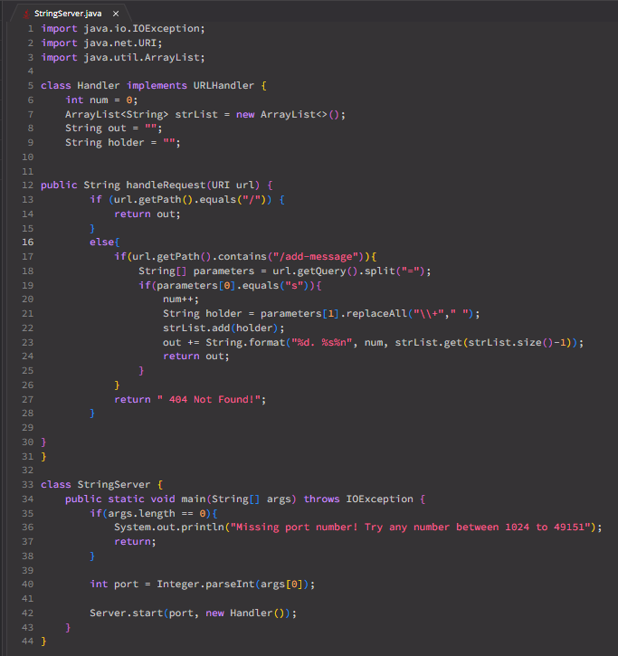
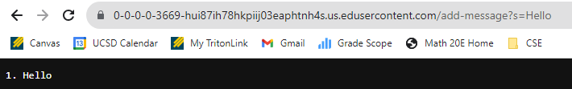
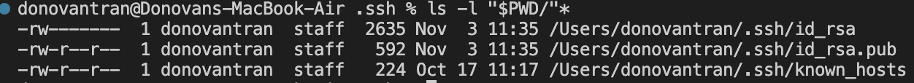
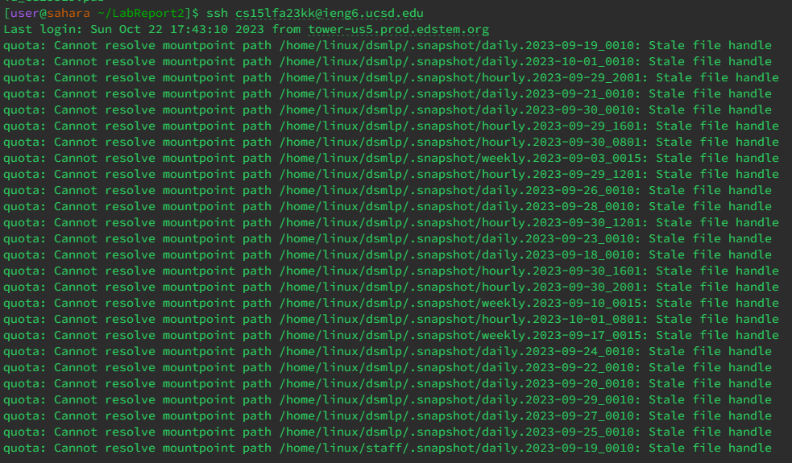

# Lab Report 2
---

## Part 1

This is the image for the code for my StringServer.

1. The method that is called is the `main` method, and the `handleRequest` method.
2. Two relevant arugments to those methods would be the `Strings[] args` arugment and the `URI url` arugement. While the `args` arguments takes in the port number, the `url` arugments takes in the URL. Some of my relevant fields are my `num`, `out` and `holder` fields. Respectively, their vales are `0`, and the other two strings are `"`. Lastly there is also my ArrayList `strList`, which I use to hold the query that we split in the URL.
3. The values of `num` changes, because the list is getting longer, therefore it is incrementing as we add more messages. In this specific request, we are adding the first message to our list, so the value of `num` goes from 0 to 1. `strList` had the string `Hello` added to it. `Out` also gets longer as we add more and more messages that needs to be formatted, for now thought it only contains `1. Hello`. My `holder` field is there so we can get rid of all the "+" in the parameters, since you cannot have spaces in the URL.

1. The method that is called is the `main` method, and the `handleRequest` method.
2. Two relevant arugments to those methods would be the `Strings[] args` arugment and the `URI url` arugement. While the `args` arguments takes in the port number, the `url` arugments takes in the URL. Some of my relevant fields are my `num`, `out` and `holder` fields. Respectively, their vales are `0`, and the other two strings are `"`. Lastly there is also my ArrayList `strList`, which I use to hold the query that we split in the URL.
3. Similar to the previous question, `num` increased from 1 to 2 based on this request. `strList` had the message `How are you` added to it. `Out` also got larger, as we now have `2. How are you` added ot the string.

## Part 2

## Part 3
I have definitely learned a lot between the past two labs. Some of the things I learned about was the creation of a web server and the parts of URL. Coming from community college, a lot of the material did not transfer over like it was suppose to. This class was suppose to be taking in concurrent with CSE 12, but I had already completed that at CC. However, the material we learned in the equivalent courses did not cover anything about the terminal or even how to set up a web server. So while I feel like I am on the back burner of trying to catch up with all this information, the lab has been fun and has taught me a lot. 
